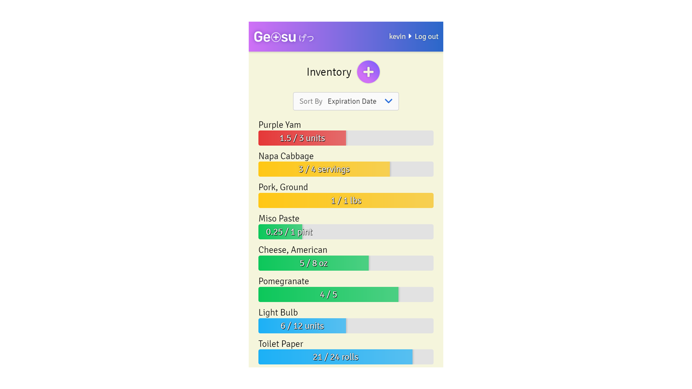

# Getsu (Client)

**Getsu is a household inventory tracker.**
- [Link to live app](https://getsu-client.kevinwei.now.sh/)
- [Link to server code](https://github.com/kevinwei00/getsu-server)

> Inventory Page (Mobile)

## Purpose

I have downloaded and used countless shopping list, pantry organizer, fridge helper, and related apps but could never find one that quite clicked. They either suffered from unintuitive UI/UX, or even worse, they were bloated with excess features that over-complicate the already stressful task of managing the items in your house. 

I just wanted something simple and elegant that showed me how much of something is left and when it was going to expire, *at a glance*.

The core philosophy that I stuck to when designing the user-facing view of Getsu was to show only as much as needed, and nothing more.

> Landing Page (Desktop)

## Features

- Add or delete named, consumable items from inventory.
- Increase or decrease item quantities, shown with progress bars.
- Set the expiration date on an item and its progress bar will change colors based on how close it is to expiring.
- Sort items by expiration date, name, or quantity.
- Access user account from any device.

## Tech Stack

*React, Node, Express, PostgreSQL, Mocha/Chai, Jest/Enzyme, HTML5, CSS3*
